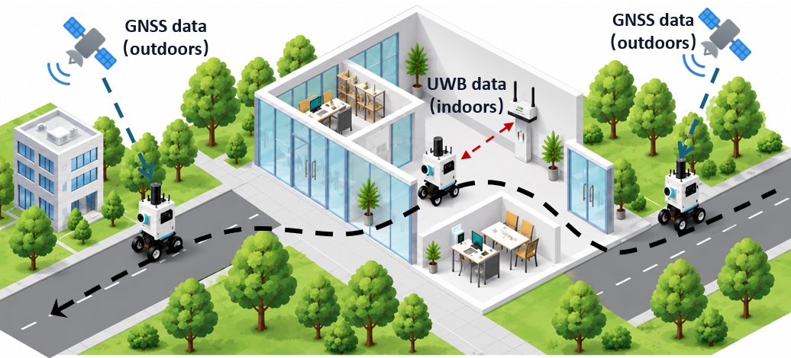
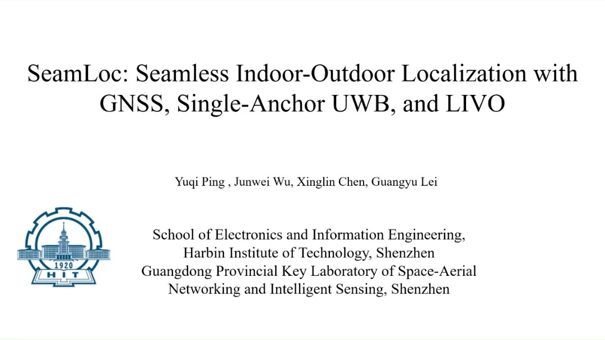
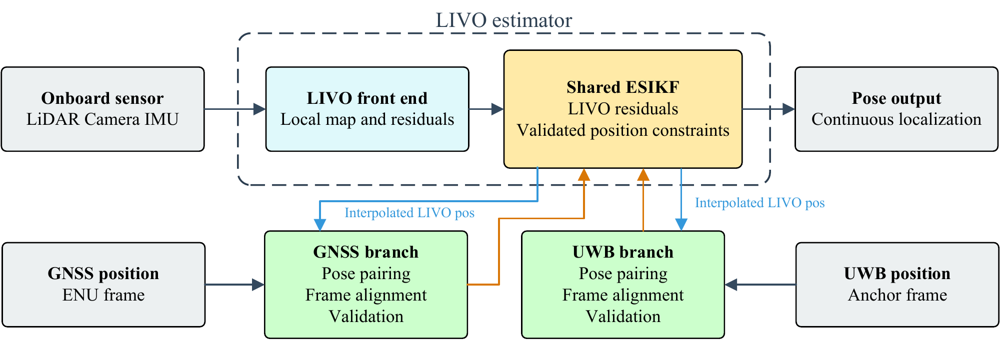

# SeamLoc

## Seamless Indoor-Outdoor Localization with GNSS, Single-Anchor UWB, and LIVO

**Yuqi Ping, Junwei Wu, Xinglin Chen, Guangyu Lei**  
Harbin Institute of Technology (Shenzhen)  
Advisors: Tianhao Liang and Tingting Zhang

[Project Website](https://ppppyq.github.io/SeamLoc/) · [Video](https://ppppyq.github.io/SeamLoc/#video) · [GitHub](https://github.com/ppppyq/SeamLoc)

SeamLoc combines global navigation satellite system (GNSS) positioning, a single multi-antenna ultra-wideband (UWB) anchor, and LiDAR-inertial-visual odometry (LIVO) within one continuous estimator. It estimates the GNSS and UWB coordinate transformations online and uses measurement quality and alignment uncertainty to weight external position constraints.

The LIVO backbone uses **FAST-LIVO2**. SeamLoc adds the external position interfaces, online coordinate frame alignment, constraint validation, and uncertainty-aware GNSS and UWB position updates. The two position sources contribute independently to the same error-state iterated Kalman filter (ESIKF), with no prior GNSS-UWB combination or hard environment switching.

## Video

[Watch on the project website](https://ppppyq.github.io/SeamLoc/#video) · [Download the MP4](https://raw.githubusercontent.com/ppppyq/SeamLoc/main/docs/assets/seamloc-demo.mp4)

## Method

GNSS and UWB measurements are paired with interpolated LIVO poses before independent frame alignment and validation. Accepted position residuals update the shared ESIKF, with alignment uncertainty propagated into the measurement covariance. When both sources are valid, their residuals and covariances are stacked in the same position update. LIVO continues to estimate motion when neither external source is reliable.

## Experimental Results

| Experiment | Reported result |
| --- | --- |
| Indoor checkpoints without GNSS | 2.69 cm three-dimensional checkpoint RMSE over a 20.32 m route |
| Outdoor closed-loop route, approximately 433 m | Three-dimensional endpoint closure error reduced from 0.701 m to 0.006 m with aligned GNSS feedback |
| Reduction in endpoint closure error | 99.1% |

The indoor result evaluates the raw LIVO trajectory at five independently measured checkpoints. The outdoor result compares GNSS feedback disabled and enabled using the same recorded measurements. No trajectory alignment or post-processing is applied. Endpoint closure error measures return-to-start consistency; it is not a full-trajectory ground-truth accuracy measure. These two experiments do not by themselves constitute a complete GNSS-UWB handover evaluation.

## GitHub

[SeamLoc repository](https://github.com/ppppyq/SeamLoc)

Related open-source projects are maintained in [REFERENCES.md](REFERENCES.md).

| Project | Relevance |
| --- | --- |
| [FAST-LIVO2](https://github.com/hku-mars/FAST-LIVO2) | LIVO estimation and mapping backbone adopted by SeamLoc |
| [FAST-LIO](https://github.com/hku-mars/FAST_LIO) | Related LiDAR-inertial odometry research |
| [LIV_handhold](https://github.com/xuankuzcr/LIV_handhold) | Reference handheld hardware, sensor drivers, and synchronization designs |
| [FAST-Calib](https://github.com/hku-mars/FAST-Calib) | Related LiDAR-camera extrinsic calibration toolkit |

## Code

## Acknowledgments

We sincerely thank Chunran Zheng, Fu Zhang, and the FAST-LIVO2 contributors for sharing their research and implementation. FAST-LIVO2 supplies the LIVO estimation and mapping foundation used in SeamLoc. We also thank the maintainers of the related open-source projects listed above. These references acknowledge their work and do not imply an endorsement of SeamLoc.

## Contact

Yuqi Ping: [pingyq@stu.hit.edu.cn](mailto:pingyq@stu.hit.edu.cn)

## Website Maintenance

The static project website is in `docs/`. Its video and figures are in `docs/assets/`. The `code/` directory is intentionally empty. See [WEBSITE.md](WEBSITE.md) for local previews and GitHub Pages settings.
